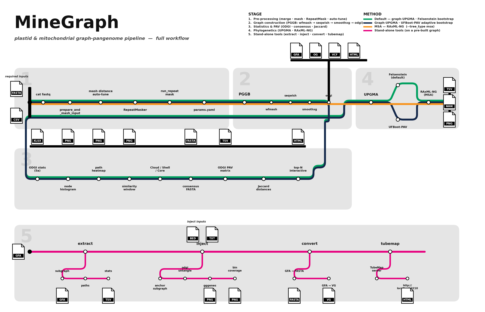
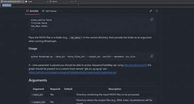
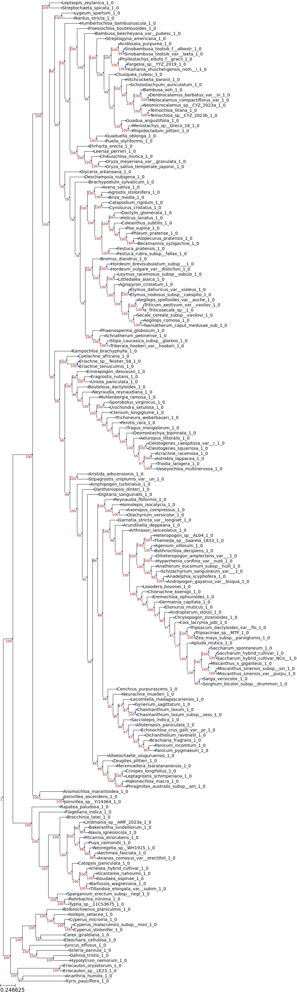
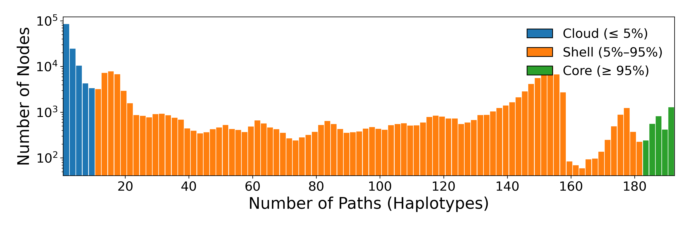
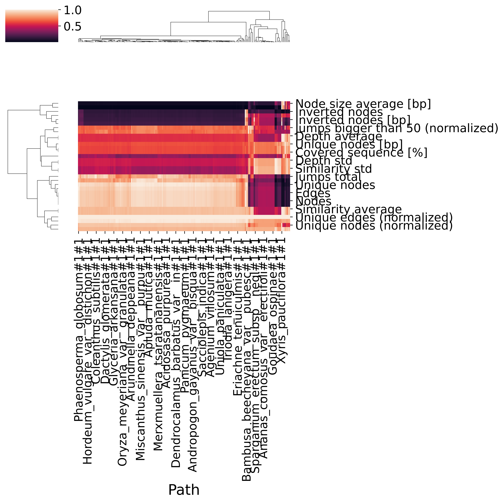
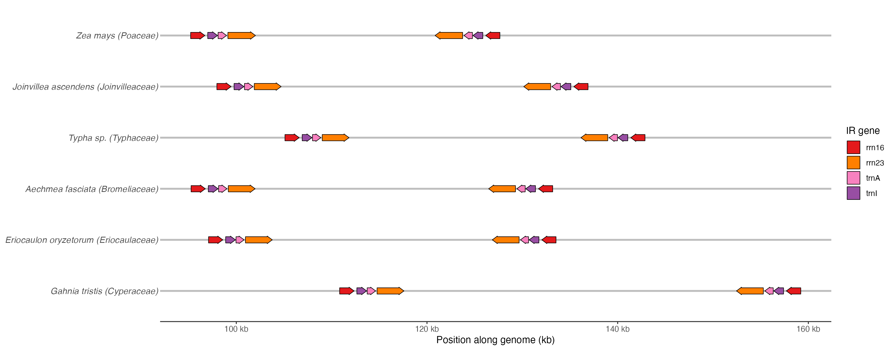
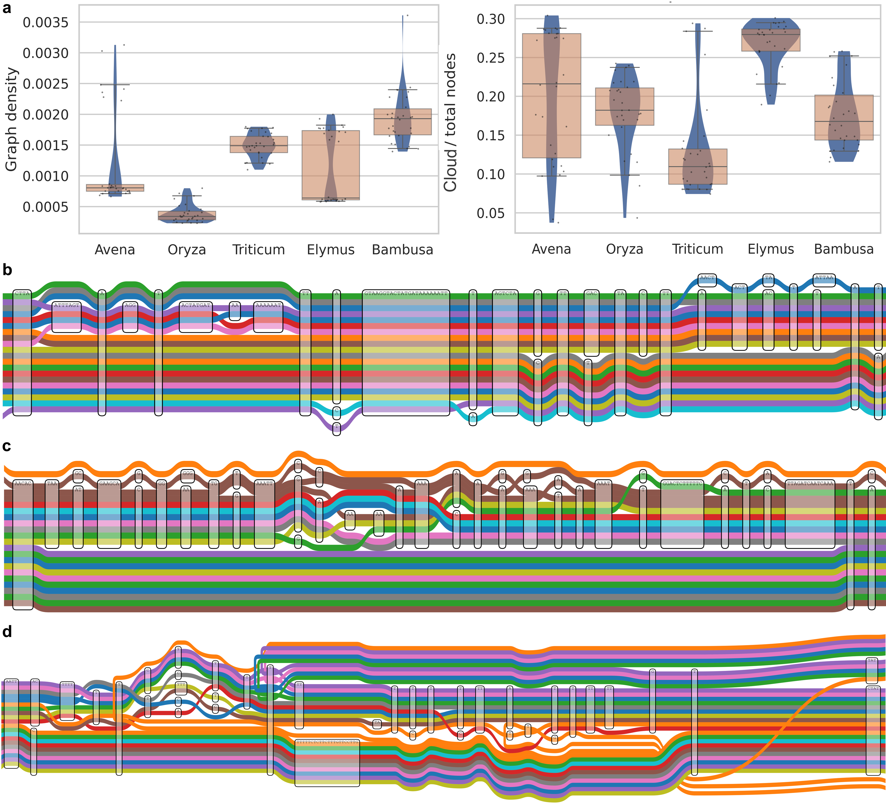

<p align="center">
  
</p>

<h1 align="center">MineGraph</h1>
<p align="center"><em>Plastid &amp; Mitochondrial Graph-Pangenome Toolkit</em></p>

<p align="center">
  
  
  
  
</p>

---

## Overview

MineGraph is a **Docker-orchestrated pipeline** for constructing, analysing, annotating, and visualising graph-pangenomes of plastid and mitochondrial genomes — from raw FASTA files to publication-ready phylogenetic trees and gene-arrow plots.

**What it does:**

- Auto-tunes PGGB parameters (percent identity, segment length) from your data
- Constructs a variation graph with PGGB / ODGI
- Classifies nodes into **Cloud / Shell / Core** with tunable thresholds
- Generates interactive and publication-quality plots + graph statistics (XLSX)
- Builds phylogenetic trees — **graph-based UPGMA** with Felsenstein or adaptive UFBoot-PAV bootstrap, or **RAxML-NG MSA-based**
- Injects gene annotations and produces **gggenes gene-arrow** visualisations
- Extracts subgraphs and inspects path composition
- Converts GFA graphs to FASTA or VG format
- Launches interactive visualisation via SequenceTubeMap
- **Resumes** interrupted runs from any step — including partial Step 5 sub-steps
- **Benchmarks** every pipeline step: wall time, peak CPU%, peak RAM

---

## Pipeline Workflow

<p align="center">
  <a href="docs/pipeline_metro_map_full.png">
    
  </a>
</p>
<p align="center"><sub><em>End-to-end MineGraph workflow. Click the figure for full resolution, or open the <a href="docs/pipeline_metro_map_full.svg">vector SVG</a>.</em></sub></p>

Every coloured track is a pipeline variant; stations are the tools run at each step; file icons mark the artifacts produced:

| Track | Variant | Invocation |
|-------|---------|------------|
| 🟢 Green | **Default** — graph-UPGMA tree with Felsenstein bootstrap | `construct --tree_type graph --bootstrap-method felsenstein` |
| 🟦 Dark blue | Graph-UPGMA with **UFBoot-PAV** adaptive bootstrap | `construct --tree_type graph --bootstrap-method ufboot` |
| 🟧 Orange | **MSA** tree via RAxML-NG (skips Stage 3 statistics) | `construct --tree_type msa` |
| 🩷 Pink | **Stand-alone** commands on a pre-built graph | `extract` · `inject` · `convert` · `tubemap` |

Stage 2 exposes the PGGB internals (`wfmash → seqwish → smoothxg → odgi`) and Stage 5 drops pink spurs from each stand-alone hub onto its sub-functions and outputs. A simpler overview diagram and the full source are in [`docs/pipeline_workflow.md`](docs/pipeline_workflow.md).

---

## Architecture

```
Host machine
MineGraph.py              ← single entry point (pure host-side Python)
    ├── construct ──────────── Step 1: prepare_and_mash_input.py  (rakanhaib/opggb)
    │                          Step 2: RepeatMasker               (pegi3s/repeat_masker)
    │                          Step 3: run_repeatmask.py          (rakanhaib/opggb)
    │                          Step 4: run_pggb.py                (rakanhaib/opggb)        ← default
    │                               OR pggb directly              (--pggb-image, any image) ← optional
    │                          Step 5: run_stats.py               (rakanhaib/opggb)
    ├── extract ────────────── extract.py                         (rakanhaib/opggb)
    ├── inject  ────────────── inject.py + gggenes                (rakanhaib/opggb)
    ├── convert ────────────── gfa2fasta.py / vg convert          (rakanhaib/opggb)
    └── tubemap ────────────── SequenceTubeMap                    (rakanhaib/sequencetubemap)
```

No docker-in-docker. Each step is an independent `docker run`.

The metro map above shows how these containers, inputs, and outputs connect end-to-end.

---

## System Requirements

| Requirement | Notes |
|-------------|-------|
| **Docker** | Required — pulls `rakanhaib/opggb` and `pegi3s/repeat_masker` |
| **Python ≥ 3.9** | Host only; install `pandas pyyaml` (`pip install pandas pyyaml`) |
| **≥ 16 GB RAM** | Recommended for typical datasets; large graphs benefit from ≥ 64 GB |
| **linux/amd64 or arm64** | Platform flag auto-detected |

### Pull the container images

MineGraph is fully dockerised. Pull the latest images before the first run so no step has to wait on a download:

```bash
docker pull rakanhaib/opggb:latest              # construct / extract / inject / convert / stats
docker pull rakanhaib/sequencetubemap:latest    # tubemap interactive viewer
docker pull pegi3s/repeat_masker:latest         # RepeatMasker step
```

Always re-pull `rakanhaib/opggb:latest` after updating MineGraph — the host scripts and the container toolchain are version-locked.

---

## Quick Start

```bash
# ── Full pipeline (recommended) ─────────────────────────────────────────────
python MineGraph.py construct -- \
  --data_dir  ./plastid_fasta \
  --output_dir ./out \
  --metadata  ./samples.csv \
  --threads   32

# ── Resume an interrupted run ────────────────────────────────────────────────
python MineGraph.py construct -- \
  --data_dir ./plastid_fasta --output_dir ./out \
  --metadata ./samples.csv --threads 32 --resume

# ── Build graph only, skip statistics ────────────────────────────────────────
python MineGraph.py construct -- \
  --data_dir ./plastid_fasta --output_dir ./out \
  --metadata ./samples.csv --mode construct-graph

# ── Use clade-specific RepeatMasker database ─────────────────────────────────
python MineGraph.py construct -- \
  --data_dir ./plastid_fasta --output_dir ./out \
  --metadata ./samples.csv --species monocotyledons

# ── Use official PGGB image for graph construction (Step 4 only) ─────────────
python MineGraph.py --pggb-image ghcr.io/pangenome/pggb:latest construct -- \
  --data_dir ./plastid_fasta --output_dir ./out \
  --metadata ./samples.csv --threads 32


# ── Benchmark every pipeline step ────────────────────────────────────────────
python MineGraph.py --benchmark construct -- \
  --data_dir ./plastid_fasta --output_dir ./out --metadata ./samples.csv

# ── Extract a subgraph ───────────────────────────────────────────────────────
python MineGraph.py extract -- subgraph \
  -i out/pggb_output/graph.smooth.final.gfa \
  -w wanted_paths.txt -o subgraph.gfa

# ── Inject gene annotations and plot gene arrows ─────────────────────────────
python MineGraph.py inject \
  --graph graph.og --bed genes.bed \
  --genomes reps.txt --output ./inject_out --threads 8

# ── Convert to FASTA ─────────────────────────────────────────────────────────
python MineGraph.py convert fasta -i graph.gfa -o graph.fasta

# ── Visualise interactively ───────────────────────────────────────────────────
python MineGraph.py tubemap -i graph.gfa
# then open http://localhost:3210
```

---

## Commands

### 1 · `construct` — Build a Pangenome Graph

```
python MineGraph.py construct -- [OPTIONS]
```

All options after `--` are forwarded to the pipeline steps inside the container.

#### Required parameters

| Parameter | Description |
|-----------|-------------|
| `--data_dir PATH` | Directory containing input FASTA files |
| `--output_dir PATH` | Output root directory |
| `--metadata FILE` | `.csv` or `.xlsx` listing FASTA filenames (one per row, first column) |

#### Core options

| Parameter | Default | Description |
|-----------|---------|-------------|
| `--threads INT` | `16` | CPU threads passed to all steps |
| `--mode` | `all` | `all` · `extract-tr` · `construct-graph` (see below) |
| `--species STR` | `viridiplantae` | RepeatMasker `-species` clade. Use narrower clades for better sensitivity: `embryophyta`, `magnoliophyta`, `monocotyledons`, `poaceae` |
| `--resume` | off | Resume from last completed step (see **Resume** section) |
| `--convert-gfa` | off | Convert final GFA to VG + FASTA after statistics |
| `--sq_view` | off | Launch SequenceTubeMap viewer after construction |

#### Statistics and plots

| Parameter | Default | Description |
|-----------|---------|-------------|
| `--plots` | on | Generate all statistical plots |
| `--only-stats` | off | XLSX statistics only; skip plots and tree |
| `--quantile FLOAT` | `25` | Consensus node presence threshold (%) |
| `--top_n INT` | `50` | Top-N nodes shown in interactive HTML plot |
| `--window_size INT` | `1000` | Sliding window size for similarity analysis |
| `--sc_th INT` | `5` | Cloud/Core boundary (%). Nodes in ≤ threshold% → Cloud; ≥ (100−threshold)% → Core |

#### Phylogenetic tree

| Parameter | Default | Description |
|-----------|---------|-------------|
| `--phyl-tree` | on | Generate phylogenetic tree |
| `--tree_type` | `graph` | `graph` (UPGMA on ODGI PAV matrix) or `msa` (RAxML-NG) |
| `--bootstrap-method` | `felsenstein` | Bootstrap algorithm for graph tree: `felsenstein` or `ufboot` |
| `--tree_bs INT` | `1000` | Felsenstein replicates (graph tree) or RAxML `--bs-trees` (MSA tree) |
| `--tree_pars INT` | `10` | RAxML parsimony starting trees (MSA tree only) |
| `--ufboot-min-rep INT` | `1000` | UFBoot: minimum replicates before convergence testing |
| `--ufboot-max-rep INT` | `10000` | UFBoot: hard cap on total replicates |
| `--ufboot-convergence FLOAT` | `0.99` | UFBoot: Pearson r convergence threshold |
| `--ufboot-batch INT` | `100` | UFBoot: replicates per convergence-check round |

#### Workflow modes

| Mode | Steps run |
|------|-----------|
| `all` (default) | Prepare → RepeatMask → PGGB → Statistics + Tree |
| `extract-tr` | Prepare → RepeatMask only (no graph) |
| `construct-graph` | Prepare → RepeatMask → PGGB only (no statistics) |

#### Metadata file format

```
sample_A.fasta
sample_B.fasta
sample_C.fa
```

One FASTA filename per row, first column. Additional columns are ignored.

---

### 2 · `extract` — Subgraph Extraction & Inspection

```
python MineGraph.py extract -- <subcommand> [OPTIONS]
```

#### A) Extract a subgraph

```bash
python MineGraph.py extract -- subgraph \
  -i graph.gfa  -w wanted.txt  -o subgraph.gfa
```

`wanted.txt` — one path name per line. The first listed path is the extraction anchor.

#### B) Graph statistics

```bash
python MineGraph.py extract -- stats -i graph.gfa -o stats.txt
```

#### C) List paths

```bash
python MineGraph.py extract -- paths -i graph.gfa -o paths.txt [--prefix Elymus_]
```

---

### 3 · `inject` — Gene Annotation Injection & gggenes Visualisation

```
python MineGraph.py inject [OPTIONS]
```

Embeds gene annotations from a BED file into a pangenome graph as traversal paths, resolves their positions per representative genome using `odgi untangle`, and produces gene-arrow diagrams and bin-coverage heatmaps.

#### Required parameters

| Parameter | Description |
|-----------|-------------|
| `--graph / -g FILE` | Input pangenome graph (`.gfa`, `.gfa.gz`, or `.og`) |
| `--bed / -b FILE` | Gene annotations in BED6 format (col 1 = path name in graph) |
| `--genomes / -r FILE` | Text file: one representative genome path name per line |
| `--output / -o DIR` | Output directory (created automatically) |

#### Optional parameters

| Parameter | Default | Description |
|-----------|---------|-------------|
| `--threads / -t INT` | `4` | Number of threads |
| `--anchor STR` | first in `--genomes` | Anchor path for subgraph extraction |
| `--bins INT` | `500` | Number of bins for the coverage heatmap |
| `--gap INT` | `5000` | Gap threshold (bp) for merging fragmented gene segments |
| `--label-map FILE` | — | TSV: `path_prefix<TAB>display_label` for figure labels |
| `--color-map FILE` | — | TSV: `gene_name<TAB>hex_color` for gene-arrow colors |
| `--no-subgraph` | off | Skip subgraph extraction; run on the full injected graph |
| `--skip-viz` | off | Output TSV files only; skip all visualisations |

#### Outputs

```
<output>/
├── inject_gene_arrows.png / .pdf   — gene-arrow diagram (gggenes)
├── inject_bin_coverage.png / .pdf  — per-path bin-coverage heatmap
├── inject_gene_presence.tsv        — gene copy counts per genome
├── untangle.tsv                    — raw odgi untangle positions
├── bin_coverage.tsv                — raw odgi bin coverage
└── inject_stats.txt                — graph statistics summary
```

---

### 4 · `convert` — Format Conversion

#### GFA → FASTA

```bash
python MineGraph.py convert fasta -i graph.gfa -o graph.fasta
```

All segment sequences are concatenated into a single FASTA record labelled `<stem>#1`.

#### GFA → VG

```bash
python MineGraph.py convert vg -i graph.gfa -o graph.vg
```

Uses `vg convert` internally.

---

### 5 · `tubemap` — Interactive Visualisation

```bash
python MineGraph.py tubemap -i graph.gfa
```

Then open **http://localhost:3210** in your browser. Press `Ctrl+C` to stop — the container is cleaned up automatically.

<p align="center">
  
</p>

---

## Global Flags

| Flag | Description |
|------|-------------|
| `--benchmark` | Profile each pipeline step: wall time, peak CPU%, peak RAM. Writes `benchmark_report.json` to the output directory |
| `--dry-run` | Print the docker commands without running them |
| `--mkdir` | Auto-create missing host-side output directories |
| `-m host:container` | Add extra Docker volume mounts (repeatable) |
| `--image IMAGE` | Override the opggb Docker image used for Steps 1, 3, and 5 (default: `rakanhaib/opggb:latest`) |
| `--pggb-image IMAGE` | Use an alternative image for Step 4 (PGGB graph construction) only. When set, `pggb` is called directly inside this image instead of via the `run_pggb.py` wrapper. Steps 1, 3, and 5 always use `--image`. Example: `--pggb-image ghcr.io/pangenome/pggb:latest` |
| `--tubemap-image IMAGE` | Override the SequenceTubeMap image (default: `rakanhaib/sequencetubemap:latest`) |

---

## Resume

MineGraph can resume an interrupted run from any step — no recomputation of completed work.

```bash
python MineGraph.py construct -- \
  --data_dir ./data --output_dir ./out --metadata ./samples.csv \
  --threads 32 --resume
```

The host inspects `--output_dir` and determines the earliest incomplete step:

| Checkpoint detected | Meaning | Steps that will run |
|---------------------|---------|---------------------|
| `all` | Nothing done | Steps 1 → 5 |
| `tr` | FASTA ready | Steps 2 → 5 |
| `pggb` | TR data ready | Steps 4 → 5 |
| `pggb_resume` | PGGB partially done | Step 4 (with `--resume`) → 5 |
| `stats` | PGGB complete, no statistics | Step 5 (all sub-steps) |
| `stats_partial` | Statistics started | Step 5 (missing sub-steps only) |
| `done` | All outputs present | Nothing — exits immediately |

**Intra-step 5 resume** — when `stats_partial` is detected, the host checks which of the four Step 5 sub-steps have sentinel output files and skips only those that are already done:

| Sub-step | Sentinel file | Skip flag |
|----------|--------------|-----------|
| 5a — Core statistics XLSX | `statistics/graph_stats.xlsx` | `--skip-core-stats` |
| 5b — Statistical plots | `plots/node_histogram_by_paths.png` | `--skip-plots` |
| 5c — Consensus + ODGI matrix | `phylogenetics_msa/odgi_matrix.tsv` | `--skip-odgi` |
| 5d — Phylogenetic tree | `phylogenetics_msa/graph_phylo_tree.nwk` **or** `graph_phylo_tree.png` | `--skip-tree` |

---

## Node Classification

MineGraph classifies each graph node by the fraction of haplotypes that contain it, controlled by `--sc_th` (default 5%):

| Category | Criterion | Meaning |
|----------|-----------|---------|
| **Cloud** | ≤ `sc_th`% of haplotypes | Private / rare regions |
| **Shell** | between Cloud and Core | Variably shared regions |
| **Core** | ≥ `(100 − sc_th)`% of haplotypes | Conserved backbone |

---

## Phylogenetic Tree Modes

| `--tree_type` | Method | Bootstrap | When to use |
|---------------|--------|-----------|-------------|
| `graph` (default) | Jaccard distances on ODGI PAV matrix → UPGMA (average linkage) | Felsenstein column-resampling (default, 1000 reps) **or** UFBoot-PAV adaptive convergence | Fast; no MSA required; topology-native; scales to hundreds of haplotypes |
| `msa` | MAF → concatenated MSA → RAxML-NG (`GTR+G`) | RAxML `--bs-trees` | Use when sequence-level substitution model fit matters |

### Bootstrap methods (graph tree)

Both methods are **parallelised** via `joblib` (loky backend) with mmap matrix sharing — all threads are used and no memory is duplicated.

#### `felsenstein` (default)

Standard Felsenstein column-resampling bootstrap. Runs exactly `--tree_bs` replicates (default: 1000). Each replicate resamples columns with replacement and rebuilds the UPGMA tree. Support values are the percentage of replicates recovering each bipartition.

```bash
# 1000 Felsenstein bootstrap replicates with 32 threads
python MineGraph.py construct -- ... --tree_type graph \
  --bootstrap-method felsenstein --tree_bs 1000 --threads 32
```

#### `ufboot` — UFBoot-PAV adaptive bootstrap

Adapts UFBoot2 (Hoang et al. 2018, *MBE* 35:518) to PAV-Jaccard distances:

- **RELL-weighted Jaccard** via BLAS DGEMM (`(X * m) @ X.T`) — mathematically equivalent to explicit resampling but uses numpy's multi-threaded BLAS
- **Convergence-based stopping**: runs in batches; stops when Pearson r between consecutive support vectors ≥ `--ufboot-convergence` for 2 consecutive batches AND ≥ `--ufboot-min-rep` replicates are done

> Typically converges in 1000–3000 replicates; capped at `--ufboot-max-rep` (default 10000).

```bash
python MineGraph.py construct -- ... --tree_type graph \
  --bootstrap-method ufboot \
  --ufboot-min-rep 1000 --ufboot-max-rep 10000 \
  --ufboot-convergence 0.99 --ufboot-batch 100 --threads 32
```

---

## Output Structure

```
<output_dir>/
├── benchmark_report.json              # Step profiling (wall, CPU, RAM) — with --benchmark
├── params.yaml                        # Auto-tuned PGGB parameters
├── panSN_output.fasta.gz              # Merged, renamed, compressed FASTA
├── downsampled_panSN_output.fasta     # Subsampled FASTA used for mash / RepeatMasker
├── pggb_output/
│   ├── *.smooth.final.gfa             # Final variation graph
│   ├── *.smooth.final.vcf             # Variant calls
│   ├── *.smooth.maf                   # Multiple alignment format
│   ├── *.alignments.wfmash.paf        # Pairwise alignments
│   └── multiqc_report.html            # MultiQC summary
└── MineGraph_output/
    ├── statistics/
    │   ├── graph_stats.xlsx                 # Node/edge/diversity summary (Cloud/Shell/Core)
    │   └── graph_Node_Plot_frequency.*      # Histogram CSV + PNG
    ├── plots/
    │   ├── graph_top_N_interactive.html     # Interactive PyVis graph (top N nodes)
    │   ├── node_histogram_by_paths.png      # Cloud/Shell/Core bar chart
    │   ├── similarity.*                     # Window-based similarity heatmap
    │   └── paths.*                          # Path statistics heatmap
    ├── phylogenetics_msa/
    │   ├── Consensus_sequence.fasta
    │   ├── odgi_matrix.tsv                  # PAV presence/absence matrix
    │   ├── graph_phylo_tree.nwk             # Newick with bootstrap support (graph mode)
    │   ├── graph_phylo_tree_bootstrap_support.tsv
    │   ├── graph_phylo_tree.png             # Rendered tree figure
    │   └── MSA_result.fasta                 # (msa mode only)
    └── gfa_convert/                         # (with --convert-gfa)
        ├── gfa_to_vg.vg
        └── gfa_to_fasta.fasta
```

---

## Example Inputs and Outputs

A minimal end-to-end example is shipped with the repository so every command in this README can be exercised without first building a multi-gigabyte graph.

### `data/` — example inputs

| File | Used by | Format |
|------|---------|--------|
| `data/metadata.csv` | `construct --metadata` | one FASTA filename per row |
| `data/genes.bed` | `inject --bed` | BED6 gene annotations projected onto graph paths |
| `data/representatives.txt` | `inject --genomes` | one representative `path_name` per line |
| `data/subgraph.gfa.gz` | `tubemap`, `extract`, `convert` | a 10-vs-10 *Triticum × Elymus* subgraph of the 192-genome Poales chloroplast graph (gzipped) |

Decompress the subgraph before use:

```bash
gunzip -k data/subgraph.gfa.gz
```

See [`data/README.md`](data/README.md) for provenance and ready-to-run demo commands.

### `examples/` — reference outputs for every plot the pipeline produces

Each sub-folder is a drop-in reference of what a successful run looks like on the 192-genome graph.

#### 1 · `examples/construct_tree/` — graph phylogeny (`construct --phyl-tree`)

<p align="center">
  
</p>

UPGMA tree built from the Jaccard distance matrix of the ODGI PAV matrix, with Felsenstein column-resampling bootstrap support. Raw Newick (`graph_phylo_tree.nwk`) and per-branch support (`graph_phylo_tree_bootstrap_support.tsv`) are both shipped.

#### 2 · `examples/construct_stats/` — statistics and exploratory plots (Step 5)

| Plot | What it shows |
|------|---------------|
| `node_histogram_by_paths.png` | Cloud / Shell / Core distribution (stacked bars by path count) |
| `graph_Node_Plot_frequency_Node_Distribution.png` | Node-length distribution across the graph |
| `paths.path.heatmap.png` | ODGI per-path node-coverage heatmap |
| `similarity.similarity_window.png` | Sliding-window similarity heatmap |
| `graph_stats.csv`, `node_distribution.csv` | Raw numeric summaries behind the plots |

<p align="center">
  
  &nbsp;
  
</p>

#### 3 · `examples/inject_output/` — `inject` gene-arrow visualisation

<p align="center">
  
</p>

Produced by projecting `data/genes.bed` onto representative chloroplast paths with `odgi untangle` and rendering the result with `gggenes`. `gene_arrows_gggenes.tsv` is the truncated intermediate table that feeds the plot.

#### 4 · `examples/subgraph_tubemap/` — SequenceTubeMap on a subgraph

Once `data/subgraph.gfa.gz` is decompressed, launch the interactive viewer:

```bash
python MineGraph.py tubemap -i data/subgraph.gfa
# then open http://localhost:3210
```

The reference rendering below is Figure 4 of the accompanying manuscript — the same *Triticum × Elymus* subgraph shipped in `data/`, captured from SequenceTubeMap and annotated for publication:

<p align="center">
  
</p>

> PGGB outputs are **not** bundled as examples — PGGB is already dockerised and self-contained. Pull `rakanhaib/opggb:latest` (see **Pull the container images** above) and MineGraph will invoke it for you.

### `analysis/` — downstream analysis scripts used in the manuscript

All scripts that turn MineGraph outputs into the figures and tables of the manuscript live under [`analysis/`](analysis/), grouped by analysis (not by reviewer comment):

```
analysis/
├── phylogenetic_comparison/     # graph tree vs published phylogenies
├── displacement_analysis/       # per-taxon displacement + pairwise matrices
├── site_concordance/            # SCF on the MAF alignment
├── pav_linkage_disequilibrium/  # LD on PAV nodes + t-SNE sensitivity
├── compartment_provenance/      # LSC / IR / SSC BLAST partition
├── gene_pav/                    # gene-level PAV heatmaps
├── topology_analysis/           # path convergence, bubbles, symmetry
├── go_enrichment/               # topGO consensus vs non-consensus
├── family_node_enrichment/      # family-unique node enrichment
├── ward_clustering/             # Ward dendrogram with BS × IR overlay
├── pav_tsne/                    # t-SNE of PAV matrix
└── figure_composition/          # multi-panel figure assembly
```

Each folder is independently runnable once MineGraph has produced `odgi_matrix.tsv`, `graph_phylo_tree.tree`, and `graph_stats.xlsx`. See [`analysis/README.md`](analysis/README.md) for inputs, outputs, and dependency lists.

---

## Citations

If you use MineGraph, please cite the tools it depends on:

> Garrison E. et al. Building pangenome graphs. *Nature Methods* (2024). https://doi.org/10.1038/s41592-024-02430-3

> Beyer W. et al. SequenceTubeMap: visualization for graph-based genomes. *Bioinformatics* (2019). https://doi.org/10.1093/bioinformatics/btz597

> Vorbrugg S. et al. Gretl – Variation GRaph Evaluation TooLkit. *bioRxiv* (2024). https://doi.org/10.1101/2024.03.04.580974

> Hoang D.T. et al. UFBoot2: Improving the Ultrafast Bootstrap Approximation. *Molecular Biology and Evolution* (2018). https://doi.org/10.1093/molbev/msx281

---

<p align="center"><em>MineGraph — fast, reproducible, topology-native plastid and mitochondrial pangenome analysis.</em></p>
