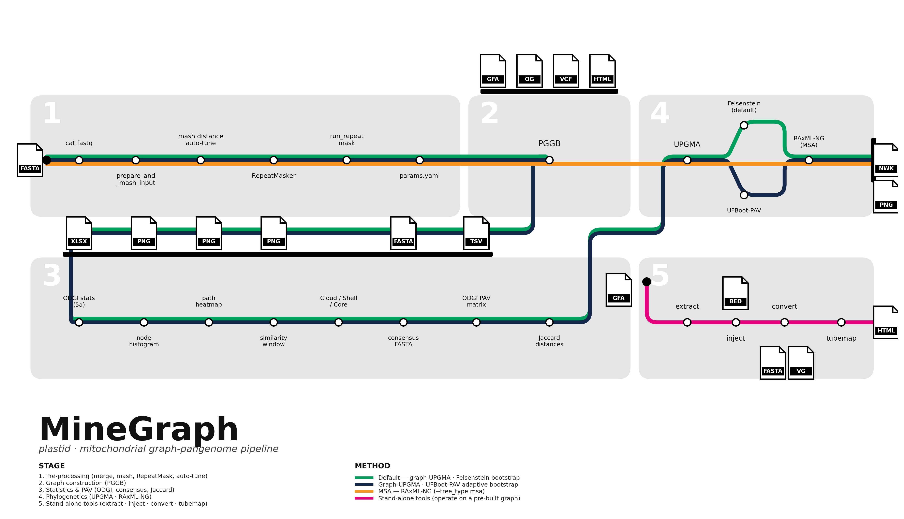
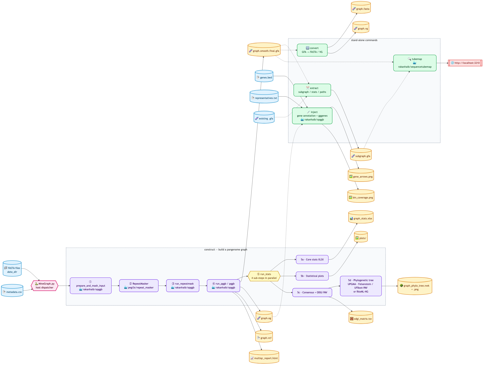
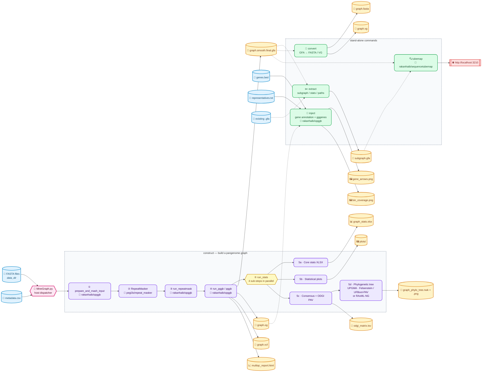

# MineGraph Pipeline — Workflow Diagram

End-to-end node-graph of every container, input, and output produced by the MineGraph dispatcher. The five construction steps run sequentially; Step 5 fans out into four parallel sub-steps. The four stand-alone commands (`extract`, `inject`, `convert`, `tubemap`) consume graphs already on disk and can be invoked independently.

## Rendered diagram — metro-map (nf-core style)

### Full workflow with CSV metadata input, PGGB internals, and stand-alone sub-functions

<p align="center">
  
</p>

*Static renders: [`pipeline_metro_map_full.png`](pipeline_metro_map_full.png) (raster) and [`pipeline_metro_map_full.svg`](pipeline_metro_map_full.svg) (vector).*

The full map exposes every step the dispatcher drives:

* **Required inputs** — `FASTA` and `CSV` metadata join the trunk before Stage 1 begins.
* **Stage 2** expands PGGB into its internal stations: `wfmash` → `seqwish` → `smoothxg` → `odgi`.
* **Stage 4** shows all three phylogenetic options in one panel: `UPGMA + Felsenstein`, `UPGMA + UFBoot-PAV`, and `RAxML-NG` (MSA).
* **Stage 5** drops pink spurs from each stand-alone hub down to its sub-functions and output files:
  * `extract` → `subgraph` · `paths` · `stats`
  * `inject` → `anchor subgraph` · `odgi untangle` · `gggenes` · `bin coverage`
  * `convert` → `GFA → FASTA` · `GFA → VG`
  * `tubemap` → `TubeMap server` · `http://localhost:3210`

Regenerate with:

```bash
python docs/_render_pipeline_map_full.py   # requires matplotlib
```

### Simple overview

<p align="center">
  
</p>

*Static renders: [`pipeline_metro_map.png`](pipeline_metro_map.png) (raster) and [`pipeline_metro_map.svg`](pipeline_metro_map.svg) (vector).*

Each colored track is a pipeline variant; stations are tools or sub-steps; white-circle stations share across tracks, and file icons at the ends of each terminus show the artifact produced.

| Track | Variant | Invocation |
|-------|---------|------------|
| 🟢 Green | Default — graph-UPGMA tree with Felsenstein bootstrap | `construct --tree_type graph --bootstrap-method felsenstein` |
| 🟦 Dark blue | Graph-UPGMA with UFBoot-PAV adaptive bootstrap | `construct --tree_type graph --bootstrap-method ufboot` |
| 🟧 Orange | MSA tree via RAxML-NG (skips Stage 3) | `construct --tree_type msa` |
| 🩷 Pink | Stand-alone commands on a pre-built graph | `extract` · `inject` · `convert` · `tubemap` |

The overview map is regenerated by [`_render_pipeline_map.py`](./_render_pipeline_map.py):

```bash
python docs/_render_pipeline_map.py   # requires matplotlib
```

## Alternative view — Mermaid flowchart

A more conventional boxes-and-arrows view is also provided for GitHub's built-in Mermaid renderer:

<p align="center">
  
</p>

### Mermaid source



## Legend

| Colour | Meaning |
|--------|---------|
| 🔵 Blue | Input file supplied by the user |
| 🟣 Purple | Containerised pipeline step (Docker) |
| 🟡 Yellow (dashed header) | Fan-out / parallel branch controller |
| 🟢 Green | Stand-alone command (runs on an existing graph) |
| 🟠 Amber | Output file produced by MineGraph |
| 🔴 Red | Interactive viewer endpoint |
| 🩷 Pink | Host-side Python dispatcher (`MineGraph.py`) |

Solid arrows show the default construct pipeline. Dashed arrows mark graphs re-used by stand-alone commands — any of the three output graphs (`.gfa`, `.og`, or a previously extracted subgraph) can feed `extract`, `inject`, `convert`, or `tubemap`.

## Step → artefact reference

| Step | Script | Image | Writes |
|------|--------|-------|--------|
| ① Prepare + mash | `src/prepare_and_mash_input.py` | `rakanhaib/opggb` | `panSN_output.fasta.gz`, `params.yaml` |
| ② RepeatMask | RepeatMasker | `pegi3s/repeat_masker` | masked FASTA |
| ③ Post-mask | `src/run_repeatmask.py` | `rakanhaib/opggb` | repeat-annotated FASTA |
| ④ PGGB | `src/run_pggb.py` (or `pggb` direct) | `rakanhaib/opggb` or `--pggb-image` | `*.smooth.final.gfa/.og/.vcf`, `multiqc_report.html` |
| ⑤a | `src/run_stats.py` | `rakanhaib/opggb` | `graph_stats.xlsx`, `graph_Node_Plot_frequency.*` |
| ⑤b | `src/run_stats.py` | `rakanhaib/opggb` | `node_histogram_by_paths.png`, `paths.path.heatmap.*`, `similarity.*` |
| ⑤c | `src/run_stats.py` | `rakanhaib/opggb` | `Consensus_sequence.fasta`, `odgi_matrix.tsv` |
| ⑤d | `src/run_stats.py` | `rakanhaib/opggb` | `graph_phylo_tree.nwk` + `.png`, `*_bootstrap_support.tsv` |
| `extract` | `src/extract.py` | `rakanhaib/opggb` | subgraph GFA, paths list, stats text |
| `inject` | `src/inject.py` | `rakanhaib/opggb` | `inject_gene_arrows.*`, `inject_bin_coverage.*`, TSVs |
| `convert` | `src/gfa2fasta.py` / `vg convert` | `rakanhaib/opggb` | `graph.fasta`, `graph.vg` |
| `tubemap` | SequenceTubeMap server | `rakanhaib/sequencetubemap` | live viewer at `:3210` |

## Rendering to PNG / SVG (optional)

GitHub renders the Mermaid block above automatically. To export a static image locally:

```bash
# once:
npm install -g @mermaid-js/mermaid-cli

# then, from the repository root:
mmdc -i docs/pipeline_workflow.md -o docs/pipeline_workflow.png -w 2400 -b transparent
# or SVG:
mmdc -i docs/pipeline_workflow.md -o docs/pipeline_workflow.svg -b transparent
```
